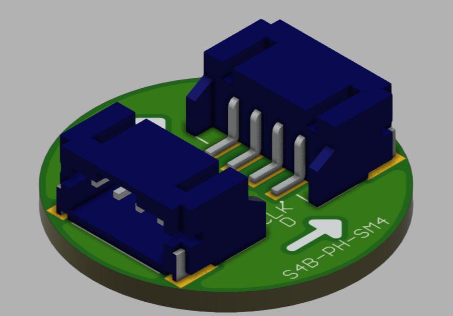
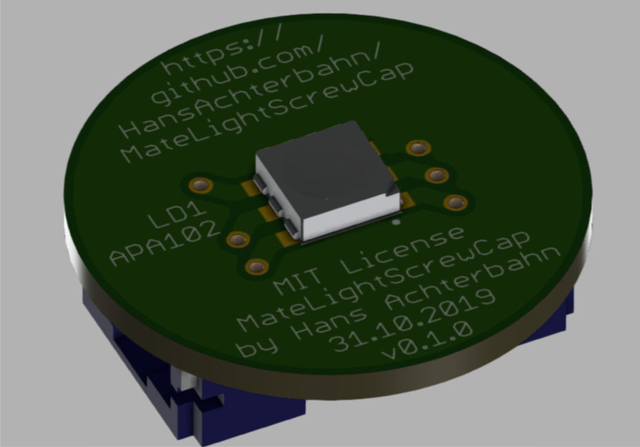
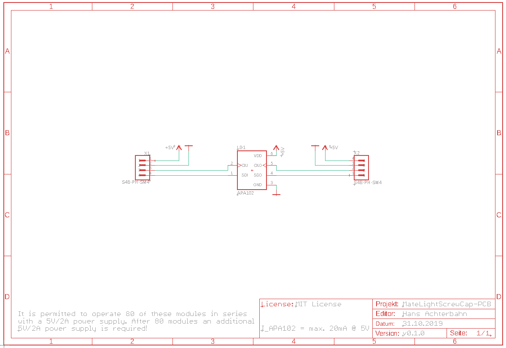
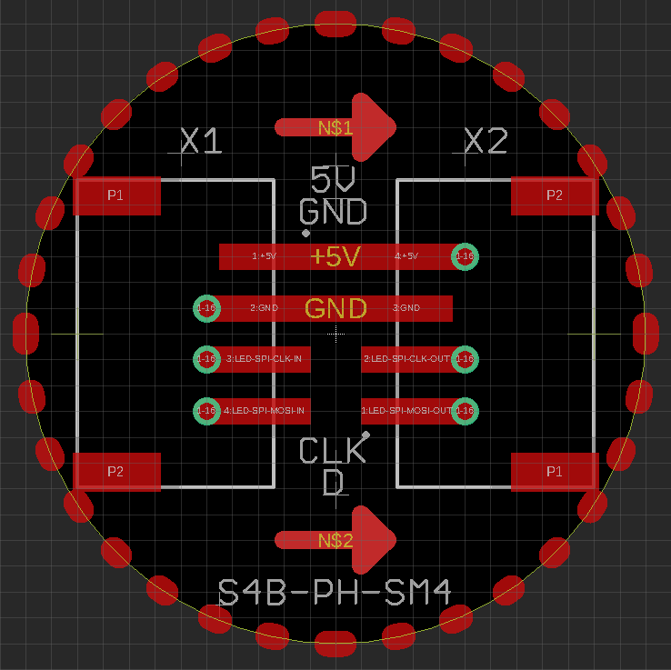

# MateLightScrewCap
This Repo is based on the idea of [MateLight](http://matelight.rocks/) and improves it by a screw cap which is easy to install and easy to remove from the coasters.

In this Repository you can find the schematics and board layouts created in Eagle. Also, you can find a 3D model of the PCB.

*Fork me and have fun!*

## 3D View (Fusion360)

Animated 3D STL modell: [3d-model/MateLightScrewCap.stl](https://github.com/HansAchterbahn/MateLightScrewCap/blob/Release-36c3/3d-model/MateLightScrewCap.stl)

__Top view__

__Bottom view__

## Schematic

## Board

__Top view__

__Bottom view__

