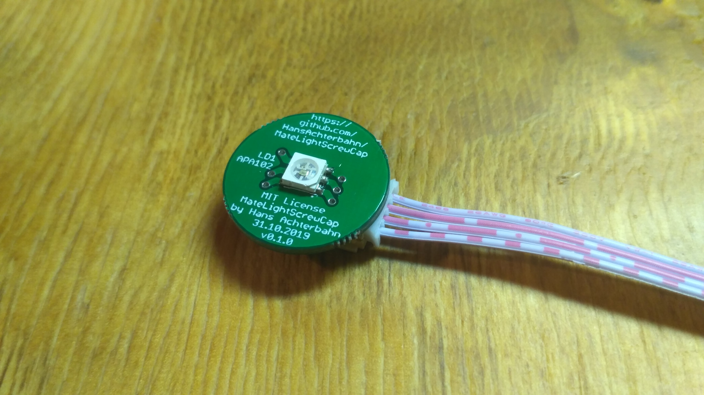

# MateLightScrewCap
This Repo is based on the idea of [MateLight](http://matelight.rocks/) and improves it by a screw cap which is easy to install and easy to remove from the coasters.

In this Repository you can find
- PCB schematics and board layouts created in Eagle,
- PCB Gerber data (ready for manufacturing),
- a 3D model of the PCB and
- a 3D model of the screw cap (for 3D printer).

Have also a look to the following Repos with Python Code for our MateLight for use with a Raspberry Pi:
- https://git.cccgoe.de/jugendgruppe/matelight-effects
- https://git.cccgoe.de/jugendgruppe/matelight
- https://git.cccgoe.de/jugendgruppe/ml_simulator

A small presentation about the PCB assembly process can be found here:
- https://jugendgruppe.cccgoe.de/reveal_js/00-MateLightScrewCapSoldering.html
- https://jugendgruppe.cccgoe.de/projekte/matelight.html

*Fork me and have fun!*


**MateLight of CCC youth group Göttingen at the 36c3 event 2019 in Leipzig**


## Power source

An APA102C LED consumes a maximum of 60 mA (red/green/blue each 20 mA). It is recommended to use a new 5 V / 1.4 mA power source for each 20 bottles(higher current delivery does not matter).

```
  ___  ^ 5V /    LED 1                            LED 19             LED 20             ___  ^ 5V /   LED 21
   |   | 1.4A  ___________  +5V            +5V   ___________  +5V    ___________ +5V     |   | 1.4A  ___________  +5V
   |   °------|    ___    |------         ------|    ___    |------|    ___    |--|      |   °------|    ___    |------
   |     GND  |   /   \   | GND            GND  |   /   \   | GND  |   /   \   | GND     |     GND  |   /   \   | GND
---°----------|  |     |  |------         ------|  |     |  |------|  |     |  |---------°----------|  |     |  |------
         CLK  |  |     |  | CLK     ...    CLK  |  |     |  | CLK  |  |     |  | CLK           CLK  |  |     |  | CLK     ...
------->------|  |     |  |------         ------|  |     |  |------|  |     |  |------------->------|  |     |  |------
         D    |   \___/   | D              D    |   \___/   | D    |   \___/   | D             D    |   \___/   | D
------->------|___________|------         ------|___________|------|___________|------------->------|___________|------
```

## 3D View (Fusion360)

Animated 3D STL model: [3d-model/MateLightScrewCap.stl](https://github.com/HansAchterbahn/MateLightScrewCap/blob/master/3d-model/MateLightScrewCap.stl)

__Top view__


__Bottom view__


## Schematic


## Board

__Top view__


__Bottom view__


## Manufacturing and assembly

__Manufactured PCBs__


__PCB with Cable__



__Manufactured screw caps__


__Assembled Mate bottle with PCB and screw cap__


__Assembled Mate bottle with PCB and screw cap lighting red__


